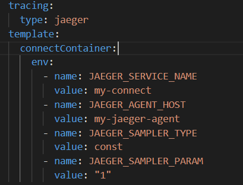

# Kafka Connect e Debezium e jaeger


O suporte de rastreamento no Strimzi é baseado em dois projetos de código aberto:

* OpenTracing
* Jaeger

Ambos os projetos fazem parte da Cloud Native Computing Foundation, https://www.cncf.io/.

> OpenTracing é uma API independente para rastreamento distribuído que oferece suporte a diferentes protocolos e linguagens de programação. O próprio OpenTracing não implementa o rastreamento. Ele fornece apenas uma API interoperável para várias linguagens de programação. Outros projetos usam essas APIs para construir a implementação de rastreamento real sobre ela, como por exemplo o Jaeger.

O cliente Jaeger é executado como parte de seu aplicativo. Por exemplo, produtor ou consumidor do Kafka, ou um dos componentes Kafka gerenciados pelo Operator Strimzi, como Kafka Connect ou Mirror Maker 2.0.

O aplicativo usa a API OpenTracing para criar extensões de rastreamento e anexar IDs de rastreamento a solicitações de saída. O cliente Jaeger é responsável por propagar as informações sobre os spans para o agente Jaeger. 

> O agente Jaeger geralmente é deployado no DaemonSet do Kubernetes.

O cliente geralmente não envia todos os rastreamentos ao agente, mas geralmente apenas uma pequena porcentagem, uma amostragem.

## Instalando os operator Jaeger

```sh
$ ubectl create -f https://raw.githubusercontent.com/jaegertracing/jaeger-operator/master/deploy/crds/jaegertracing.io_jaegers_crd.yaml 
$ kubectl create -f https://raw.githubusercontent.com/jaegertracing/jaeger-operator/master/deploy/service_account.yaml
$ kubectl create -f https://raw.githubusercontent.com/jaegertracing/jaeger-operator/master/deploy/role.yaml
$ kubectl create -f https://raw.githubusercontent.com/jaegertracing/jaeger-operator/master/deploy/role_binding.yaml
$ kubectl create -f https://raw.githubusercontent.com/jaegertracing/jaeger-operator/master/deploy/operator.yaml
```

Listando o Pod e deployments do operator Jaeger

```sh
$ kubectl get pods --selector=name=jaeger-operator
$ kubectl get deployment jaeger-operator
```


Criando os componentes do jaeger

```sh
$ kubectl apply -f jaeger.yaml
```

## Listando os componentes do jaeger

```sh
$ kubectl get pods --selector=app.kubernetes.io/instance=my-jaeger
$ kubectl get services
```

Observe que foi criado varios serviços


* `Agente` é o componente localizado no aplicativo para reunir os dados de rastreamento Jaeger localmente. Ele lida com a conexão e o controle de tráfego para o Coletor, bem como o enriquecimento dos dados.

* `O Jaeger Coletor`  é o componente responsável por receber os spans que foram capturados pelos Agente e gravá-los em um armazenamento.

* `Jaeger Consult`a é um serviço que recupera rastros do armazenamento e hospeda a interface do usuário para exibi-los.

---

## Estratégias de implantação

`All-in-One`: Esta é uma configuração fácil de implantar, boa para experimentar o produto, desenvolvimento e uso de demonstração. Você pode executá-lo como um binário predefinido ou uma imagem Docker. `Opção default`.

`Produção`: focado nas necessidades do ambiente de produção para alta disponibilidade e escalabilidade. Ele implanta cada serviço de back-end de forma independente e oferece suporte a várias réplicas e opções de dimensionamento. Ele também usa armazenamento de back-end persistente para manter os dados de rastreamento resilientes. Atualmente, ele oferece suporte às soluções de armazenamento `Elasticsearch` e `Cassandra`, com Elasticsearch como a solução recomendada para ambientes de produção.

`Streaming`: para ambientes de alta carga, esta configuração adiciona Kafka à estratégia de implantação de produção para tirar a pressão do armazenamento de back-end. Se você precisar executar a lógica de pós-processamento nos rastreamentos, será mais fácil executar antes de gravar no armazenamento.

---

### Encaminhamento de porta do service para acessar a IU em http://localhost:8080

```sh
kubectl port-forward service/my-jaeger-query 8080:16686
```

---

## Alterando o Kafka Connect

A alteração é simples basta informar o tracing e as variaveis de ambiente




A lista completa de variáveis ​​suportadas e seus significados podem ser encontrados em https://github.com/jaegertracing/jaeger-client-java/blob/master/jaeger-core/README.md#configuration-via-environment

Quando você ativa o rastreamento no Kafka Connect, o Strimzi faz duas coisas:

* Crie e registra o rastreador global.
* Configura os consumidores e produtores do Kafka Connect para usar os interceptores de rastreamento.

As informações de rastreamento ficam no cabeçalho das mensagens, para obter mais informações, consulte a documentação do OpenTracing  como injetar (https://opentracing.io/docs/overview/inject-extract/) e extrair os ids de rastreamento. Eles podem usar o rastreador global criado e registrado por Strimzi para enviar os rastros para Jaeger.

Vendo as mensagens com o rastreamento

```sh
export KAFKA_CLUSTER_NAME=cluster-eda
kubectl exec -ti $KAFKA_CLUSTER_NAME-kafka-0 -- bin/kafka-console-consumer.sh --bootstrap-server $KAFKA_CLUSTER_NAME-kafka-bootstrap:9092 --from-beginning --topic sqldebezium.dbo.produtos --property print.key=true --property print.headers=true --property print.timestamp=true
```


---


