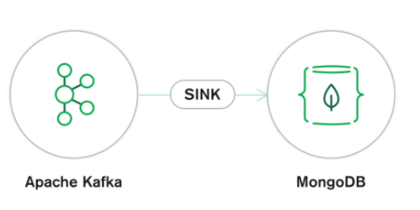
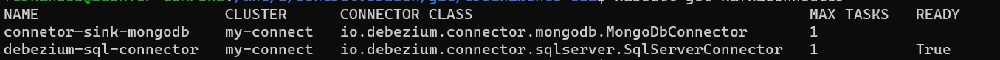

# Kafka Connect SINK Mongodb



Já configurado o plugin no cluster Kafka Connect no [Link aqui](../kafka-connect), vamos criar o connector SINK para o Mongodb, responsável por buscar as informações do Kafka e persistir ao Banco de dados.

> Estou usando o banco de dados Mongodb configurado e criado no site https://www.mongodb.com/cloud/atlas

> No arquivo connector-sink-mongodb.yaml é necessario alterar as propriedadades do seu banco dados, tais como, `connection.uri`, `database` e `collection`.


```sh
$ kubectl apply -f kafka-connect-mongodb/connector-sink-mongodb.yaml
```
Verificando se o Connector foi criado com sucesso

```sh
 $ kubectl get KafkaConnector
 ```



Usando o próprio Pod do Kafka Connect para listar os conectores criados.

```sh
$ export NAME_POD_KAFKA_CONNECT=$(kubectl get pods --selector=app.kubernetes.io/instance=my-connect --output=jsonpath={.items..metadata.name})
$ kubectl exec --stdin --tty $NAME_POD_KAFKA_CONNECT -- curl  http://localhost:8083/connectors
$ kubectl exec --stdin --tty $NAME_POD_KAFKA_CONNECT -- curl  http://localhost:8083/connectors/connetor-sink-mongodb/status

```

Para mais informações:

https://docs.mongodb.com/kafka-connector/v1.6/