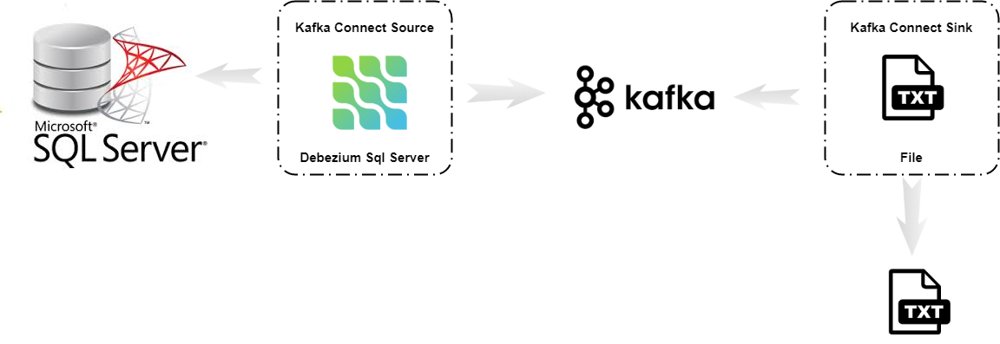
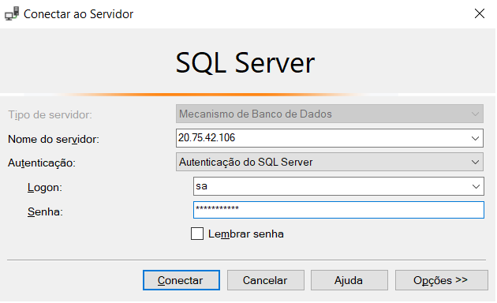
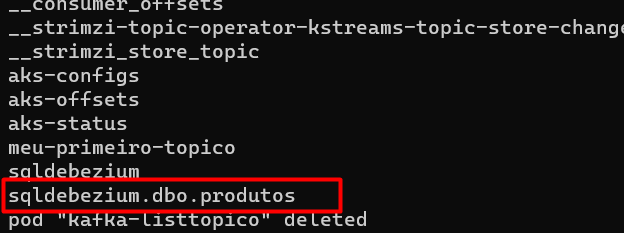
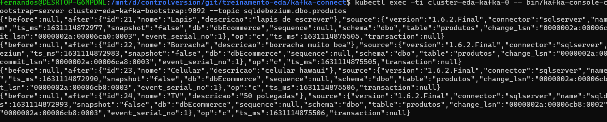
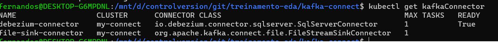

# Kafka Connect e Debezium



## Criando a imagem com plugin debezium

> O arquivo DockerFile encontrar-se versionado

```sh
$ docker image build -t <<conta>>/strimzi-kafkaconnect-debezium:0.20.0-kafka-2.6.0 .
$ docker image push <<conta>>/strimzi-kafkaconnect-debezium:0.20.0-kafka-2.6.0
```

> As imagens customizadas encontra-se no https://hub.docker.com/

## Subindo um cluster kafka connect

```sh
$ kubectl apply -f  kafka-connect/kafka-connect.yaml
```

Pode criado? Vamos ver!

```sh
$ kubectl get pods
```

Guardar o nome do Pod na variável NAME_POD_KAFKA_CONNECT para o acesso posterior.

```sh
$ export NAME_POD_KAFKA_CONNECT=$(kubectl get pods --selector=app.kubernetes.io/instance=my-connect --output=jsonpath={.items..metadata.name})
```

Listando os plugins existente, os defaults da imagem e o debezium sql que foi inserido na imagem, via Dockerfile

> usando o próprio pod do kafka connect para listar os plugins existente
```sh
$ kubectl exec --stdin --tty $NAME_POD_KAFKA_CONNECT -- curl  http://localhost:8083/connector-plugins
```

## Configurando Banco de dados CDC

Será utilizado o connector debezium para sql server, ele faz a leitura do banco de dados via CDC. 

> Para nossa exemplo iremos subir um banco de dados, caso já tenha um banco habilitado o CDC pode-se usar ele.
Mais detalhes do que é Sql Server CDC, https://docs.microsoft.com/pt-br/sql/relational-databases/track-changes/about-change-data-capture-sql-server?view=sql-server-ver15


### Criando um banco de dados sql server no próprio Kubernetes

```sh
$ kubectl apply -f kafka-kafka-connect/sql.yaml
```

Listando o serviço do Sql Server criado

```sh
$ kubectl get svc
```

Testando a conectividade



Para esse tutorial estou utilizando a imagem sql server da Microsoft `mcr.microsoft.com/mssql/server:2019-latest`.
Para criar a estrutura dos dados estou utilizando o próprio container criado.

> O arquivo para habilitar CDC e criar o banco de dados, as tabelas e popular com alguns dados está em sql/init.sql que foi executado via Microsoft SQL Server Management Studio ou você pode executar pelo próprio pod conforme código abaixo

```sh
$ export NAME_POD_SQL_SERVER=$(kubectl get pods --selector=app=mssql --output=jsonpath={.items..metadata.name})
$ export SA_PASSWORD=1q2w3e4r@#$
$ cat sql/init.sql | kubectl exec --stdin --tty $NAME_POD_SQL_SERVER -- /opt/mssql-tools/bin/sqlcmd -U sa -P $SA_PASSWORD
```

Já com o banco criado e configurado, vamos criar o connector debezium Sql Server, responsável por buscar as informações e persistir ao Kafka

```sh
$ kubectl apply -f kafka-kafka-connect/connector-debezium-sql.yaml
```

Verificando se o objeto foi criado

```sh
 $ kubectl get KafkaConnector
```

> Algumas propriedades precisam ser alteradas no arquivo `connector-debezium-sql.yaml` como o ip do seu banco de dados sql server representado pela sua propriedade `spec.config.database.hostname`.

Algumas informações básicas sobre o connector:

* `spec.class`: Nome da classe do conector que está dentro do plugin debezium
* `spec.config.database.hostname` e `spec.config.database.port`: endereço IP ou nome de host para sua instância Sql Server, bem como a porta (por exemplo 1433)
* `spec.config.database.user` e `spec.config.database.password`: nome de usuário e senha para sua instância Sql Server
* `spec.config.database.dbname`: nome do banco de dados
* `spec.config.database.server.name`: Nome lógico que identifica e fornece um namespace para o servidor / cluster de banco de dados Sql Server específico que está sendo monitorado.
* `spec.config.table.whitelist`: lista separada por vírgulas de regex especificando quais tabelas você deseja monitorar para a captura de dados alterados


> Mais detalhes nas configurações debezium podem ser encontradas aqui
https://debezium.io/documentation/reference/connectors/sqlserver.html


Vamos ver se o conector foi criado. Usando o próprio Pod para listar os conectores criados.

```sh
$ export NAME_POD_KAFKA_CONNECT=$(kubectl get pods --selector=app.kubernetes.io/instance=my-connect --output=jsonpath={.items..metadata.name})
$ kubectl exec --stdin --tty $NAME_POD_KAFKA_CONNECT -- curl  http://localhost:8083/connectors
```

Pode-se ver o status do conector, se a propriedade `state` estiver como `RUNNING`, connector está funcionando normalmente

```sh
$ kubectl exec --stdin --tty $NAME_POD_KAFKA_CONNECT -- curl  http://localhost:8083/connectors/debezium-connector/status
```

O conector agora deve entrar em ação e enviar os eventos do CDC para o tópico do Kafka chamado, `<database.server.name>.<table name>` por exemplo, `sqldebezium.dbo.produtos`.


### Testando o Conector

Vamos inserir alguns registros na tabela produtos e listar os topicos do Kafka primeiramente

```sh
$ kubectl run kafka-listtopico -ti --image=strimzi/kafka:latest-kafka-2.6.0 --rm=true --restart=Never -- bin/kafka-topics.sh --list --bootstrap-server cluster-eda-kafka-bootstrap:9092
```



Criando um consumidor, dessa vez, vamos fazer diferente, ao invés de criar um pod somente para o consumer, usaremos
o pod do cluster kafka

```sh
$ kubectl exec -ti cluster-eda-kafka-0 -- bin/kafka-console-consumer.sh --bootstrap-server cluster-eda-kafka-bootstrap:9092 --topic sqldebezium.dbo.produtos
```

```
INSERT INTO produtos(nome,descricao)  VALUES ('Lapis','lapis de escrever');
```




### Salvando os dados do topico no arquivo txt

Vamos testar, salvando toda informação que chega para o tópico `sqldebezium.dbo.produtos` via connector debezium para um arquivo texto `/tmp/file-sink-connector.txt` configurado pelo arquivo `connector-sink-file.yaml` propriedade `spec.config.file`


```sh
$ kubectl apply -f kafka-kafka-connect/connector-sink-file.yaml
```

Agora temos dois conectores




```sh
$ kubectl exec --stdin --tty $NAME_POD_KAFKA_CONNECT -- curl  http://localhost:8083/connectors/file-sink-connector/
```


Podemos ver os registros sendo gravados no arquivo `file-sink-connector.txt`
```sh
 kubectl exec --stdin --tty $NAME_POD_KAFKA_CONNECT -- tail -f /tmp/file-sink-connector.txt
```
