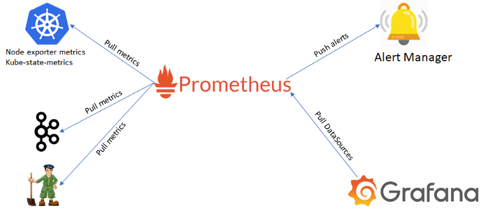
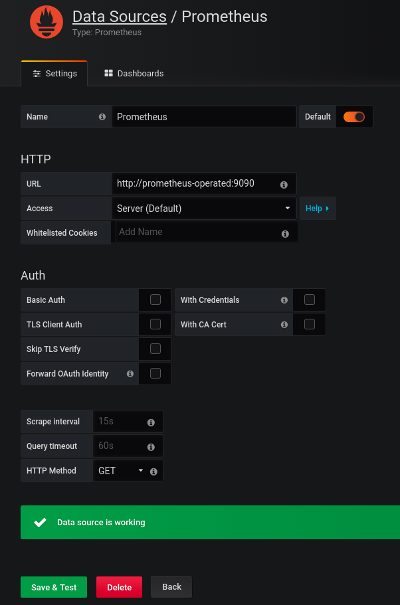
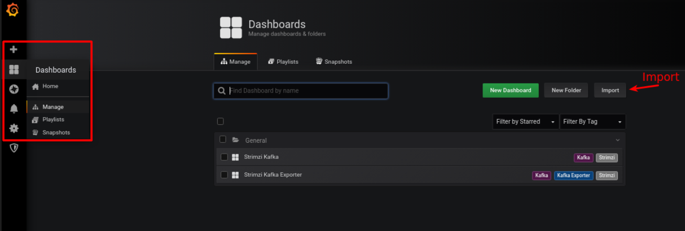
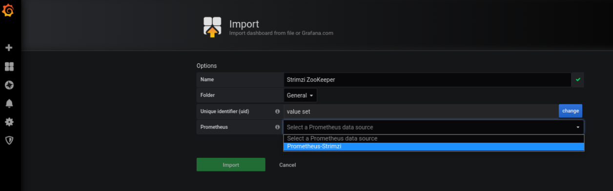

# Deploy Kafka com métricas



Como Kubernetes configurado e o Helm instalado, iremos adicionar o operator da Strimzi.

##  Adicionando o repositorio do Strimzi e instalando.
```sh
$ helm repo add strimzi https://strimzi.io/charts/
$ helm install strimzi-kafka strimzi/strimzi-kafka-operator
```

Isso instalará o Operator Strimzi (que nada mais é do que um `Deployment`), Custom Resource Definitions e outros componentes do Kubernetes, como `Cluster Roles`, `Cluster Role Bindings` e `Service Accounts`.

> Mais informações na [documentação do Strimzi](https://strimzi.io/docs/operators/0.19.0/full/using.html#overview-str)

Para confirmar se o Operador Strimzi foi instalado, verifique o pod (deve mudar para o status `Running` após algum tempo)

```sh
$ kubectl get pods -l=name=strimzi-cluster-operator
```

---

### Criando o cluster kafka exponto as métricas para o prometheus


```sh
$ kubectl apply -f kafka-metrics.yaml
```

Verificando o recurso Kafka Criado

```sh
$ kubectl get kafka
```

> O Kafka Exporter aprimora o monitoramento do Cluster Kafka e clientes, extraindo dados de métricas adicionais do Broker Kafka relacionados a compensação, grupos de consumidores, atraso do consumidor e tópicos.

---

## Instalando e configurando o prometheus

> Toda instalaçao do prometheus no Kubernetes está sendo realizada no namespace default

### Executando o deployment do operator prometheus
```sh
$ kubectl apply -f prometheus-operator-deployment.yaml
```

> Ponto a observar:


* `spec.selector.namespaceSelector.matchNames` é usado para selecionar o namespace no qual o serviço está sendo executado, que é o namespace `default`

Verificando o pod com o operator prometheus

```sh
$ kubectl get pods|grep prometheus
```

> Uma configuração adicional relacionada ao Prometheus também é fornecida para os seguintes arquivos:

* prometheus-additional.yaml
* prometheus-rules.yaml
* strimzi-pod-monitor.yaml

> O Operador do Prometheus não possui um recurso de monitoramento, como o PodMonitor de scraping nodes, portanto, o arquivo `prometheus-additional.yaml` contém a configuração adicional necessária.

Criar uma secrets parar configurações adicionais, é recomendado adicionar alguns destinos de scraping adicionais para cAdvisor, kubelet, pods e serviços. Eles podem ser adicionados ao recurso do Prometheus usando a propriedade `spec.additionalScrapeConfigs`. Para fazer isso, precisamos criar uma secrets do Kubernetes.

```sh
$ create secret generic additional-scrape-configs --from-file=prometheus-additional.yaml
```

### Executando o arquivo Strimzi-Pod-Monitor.yaml

> PodMonitor é usado para extrair dados diretamente de pods do cluster Kafka,  ZooKeeper, Operators, Kafka Bridge e Cruise Control.

> Atualize a propriedade `namespaceSelector.matchNames` com o namespace em que os pods para extrair as métricas estão em execução.

```sh
$ kubectl apply -f strimzi-pod-monitor.yaml
```


### Executando o arquivo de regras do prometheus

> As regras para o Exportador Kafka são definidas no arquivo prometheus-rules.yaml e implementadas com o Prometheus. 

```sh
$ kubectl apply -f prometheus-rules.yaml
```

O ultimo arquivo e não menos importante o `prometheus.yaml`

O arquivo prometheus.yaml de instalação já contem a propridade `additionalScrapeConfigs` apontando o para o arquivo adicional `prometheus-additional.yaml`.

 As propriedades `subjects.namespace` `alerting.alertmanagers.namespace` estão apontandas para o namespace default do kubernetes

```sh
$ kubectl apply -f ./examples/metrics/prometheus-install/prometheus.yaml
```

Se tudo der certo o pod como o prometheus vai estar rodando

```sh
kubectl get pods|grep prometheus
```

---

###Subindo ambiente do Grafana

```sh
$ kubectl apply -f ./examples/metrics/grafana-install/grafana.yaml
$ kubectl get pods|grep grafana
```

### Ativando os painéis de exemplo do Grafana

Use port-forward para redirecionar a interface de usuário do Grafana para localhost:3000:

```sh
$ kubectl port-forward svc/grafana 3000:3000
```

> O nome de usuário e a senha padrão do Grafana ambos são admin. Depois de fazer login pela primeira vez, você pode alterar a senha.

Adicione o Prometheus como uma fonte de dados....



 .... e em painéis › Importar , carregue os painéis de exemplo ou cole o JSON diretamente, os arquivos que usei para esse exemplo são:

* strimzi-zookeeper.json
* strimzi-kafka.json
* strimzi-kafka-exporter.json






### Strimzi Kafka mostra métricas para:

|Métricas|
| ------ |
|Contagem de Broker online|
|Controladores ativos na contagem do cluster|
|Taxa de eleição do broker líder|
|Réplicas que estão online|
|Contagem de partições sub-replicadas|
|Partições que estão no mínimo na contagem de réplicas de sincronização|
|Partições que estão abaixo do mínimo na contagem de réplicas de sincronização|
|Partições que não têm um líder ativo e, portanto, não são graváveis ​​ou legíveis|
|Uso de memória dos pods do broker Kafka|
|Uso agregado de CPU de pods de broker Kafka|
|Uso de disco de pods de broker Kafka|
|Memória JVM usada|
|Tempo do garbage collection JVM|
|Contagem do garbage collection JVM|
|Taxa total de bytes de entrada|
|Taxa total de bytes de saída|
|Taxa de mensagens recebidas|
|Taxa total de solicitação de produto|
|Taxa de bytes|
|Taxa de solicitação de produção|
|Obter taxa de solicitação|
|Porcentagem de tempo médio ocioso do processador de rede|
|Solicitar porcentagem de tempo médio ocioso do manipulador|
|Tamanho do log|


### Strimzi ZooKeeper mostra métricas para:

|Métricas|
| ------ |
|Tamanho do quorum do conjunto Zookeeper|
|Número de conexões vivas|
|Pedidos enfileirados na contagem do servidor|
|Contagem de observadores|
|ZooKeeper pods uso de memória|
|Uso agregado de CPU de pods ZooKeeper|
|ZooKeeper pods uso de disco|
|Memória JVM usada|
|Tempo do garbage collection JVM|
|Contagem do garbage collection JVM|
|Quantidade de tempo que leva para o servidor responder a uma solicitação do cliente (máximo, mínimo e média)|
